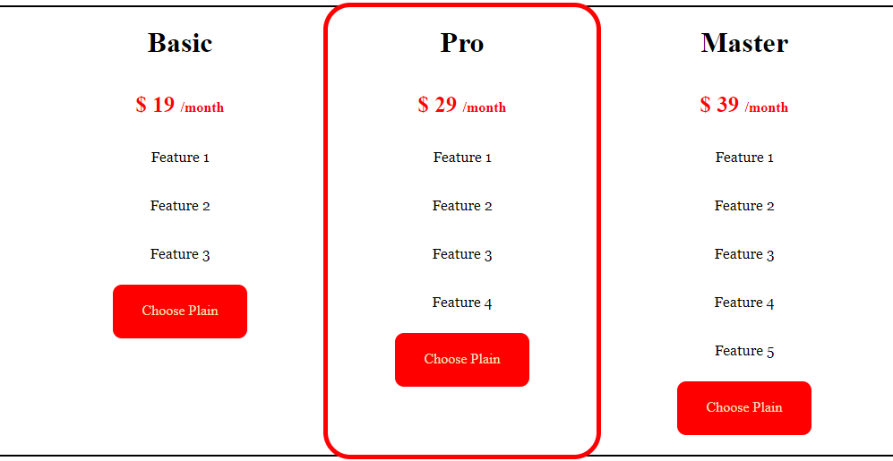

# Proyek Latihan Card

Proyek ini adalah latihan pembuatan tampilan card menggunakan HTML dan CSS. Card merupakan elemen desain yang sering digunakan untuk menampilkan informasi secara ringkas dan menarik.

## Deskripsi

File `latihan2.html` adalah contoh sederhana yang menunjukkan cara membuat card yang responsif. Card ini dirancang untuk menampilkan konten seperti gambar, judul, dan deskripsi singkat.

## Fitur

- **Desain Responsif**: Card dirancang agar dapat menyesuaikan ukuran layar dengan baik.
- **Gambar**: Memungkinkan penambahan gambar untuk menambah daya tarik visual.
- **Teks**: Menyediakan ruang untuk judul dan deskripsi.

## Teknologi yang Digunakan

- **HTML**: Struktur dasar dari halaman.
- **CSS**: Untuk penataan dan tata letak card.
- **JavaScript (Opsional)**: Jika diperlukan untuk interaktivitas tambahan.

## Cara Menjalankan

1. **Pastikan Anda memiliki XAMPP atau server lokal lain yang terinstal.**
2. **Salin file `latihan2.html` ke dalam direktori `htdocs` di XAMPP.**
3. **Buka browser dan masukkan URL berikut:**
